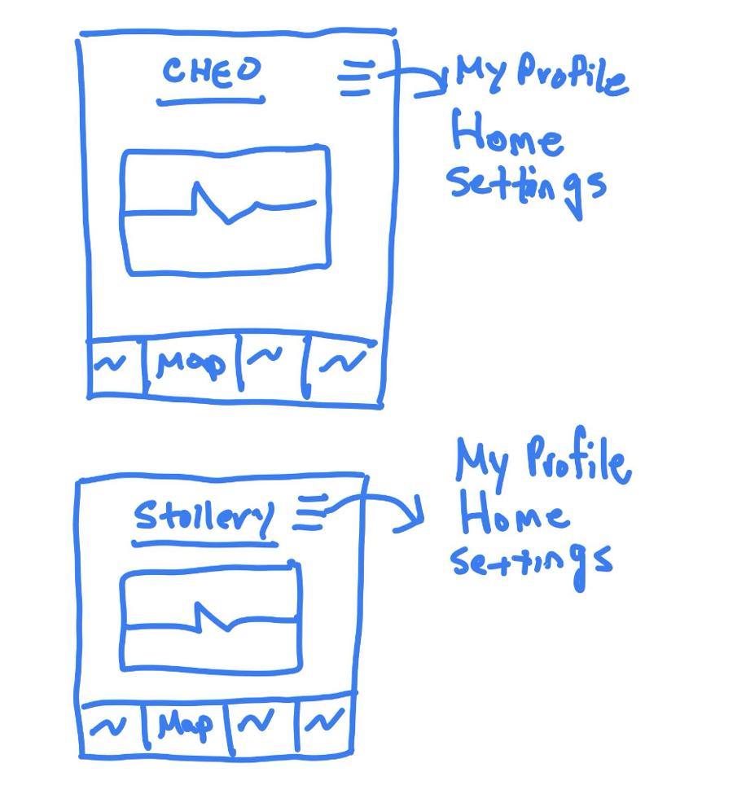

# Shape Up Pitch: Hospital Map Integration for Capstone Project
## Contributor
- Jason You (Student #: 300056239)

## Problem
- Our Capstone project aims to create a generalized app for children undergoing surgery at the Children's Hospital of Eastern Ontario (CHEO) and the Stollery Children's Hospital. This app provides essential pre-operative and post-operative information for elective surgeries, ensuring that young patients and their families have the support and guidance they need during a challenging time.

- However, after a few pilot studies that have been conducted, we have discovered an inconvenience experienced by users in the current app: there is no provision for users to access a map of the respective hospitals. This omission presents a substantial inconvenience for our users, as navigating a hospital's layout can be confusing and stressful, especially for young patients and their caregivers. To address this issue, we propose the integration of hospital maps into our app for both CHEO and the Stollery Children's Hospital.

## Appetite
- Our goal after implementing this feature is to increase the convenience and usability of the app for children who visit CHEO and Stollery for elective surgeries. We will prioritize users being able to easily locate and use the new feature, including the feature of zooming in and out to see different sections of the hospital.

- We are aiming to complete the integration of the map within one development cycle of 6 weeks. We believe that 6 weeks is ample time for us to successfully add this new feature to the app.

## Solution
- For the solution we plan to have the integration of several key features. We will integrate a zoomable, high-quality map of both the CHEO and Stollery hospitals allowing users to explore the hospital. Below is a fat marker design of what we intend the layout to look like.

- The navigation should be straightforward with the user being able to immediately locate the tab on the bottom navigation and see the map right away. For zooming in and out, the user can do so by pinching inwards or outwards with two fingers. As the app is local to the user’s device and does not require internet access, the user can easily view the map at their convenience. 
- As for the map, we will reach out to our stakeholders to have one in a mobile-friendly format that will not lose its quality when zoomed in and out of. This will ensure the accuracy of the layout of the map and will give confidence to users that this map is accurate and will be the layout of the hospital on the day of their surgery.

## No-Gos
- To ensure that our group is focused on completing this feature successfully, we will establish several no-gos. We will not add any additional features or functionalities that are unrelated to the hospital map integration during this 6-week cycle. Additionally, we will ensure that all our effort is focused on this aspect and make sure that we aren’t pulled into other projects if possible. 
- We also plan to make sure that we will not cut corners by implementing an external third-party navigating system. This will ensure that we have full control over the aspects of the map feature and can successfully integrate any feedback given by the stakeholders upon completion of the 6 week cycle.
- Finally, for the scope of this 6 week cycle we will not be including info sections for each of the different rooms in the hospitals as this may lead to clutter and confusion. It may however be a feature that we will include in future cycles. 

## Rabbit Holes
- Although the map feature seems to be easily implementable within the 6-week cycle, there will be several rabbit holes that we as a team need to be careful of. 
- Currently our app is supported in English and French. There has been an ask by our stakeholders that eventually support for Indigenous languages should also be added. Planning for this during the 6 week cycle may lead to added complexity, so for this 6 week cycle we will focus on getting the maps available in two languages, English and French.
- Next, we understand the need to make the map conform with accessibility requirements. For now, we will focus on getting the map feature in place with the zoom in and zoom out functionality. We will then conduct a focus study to ensure that accessibility requirements have been met and then fix them when the time arises. However, for this 6 week cycle we will focus on the core aspect of implementing the map. 

## Conclusion
- The Hospital Map Integration project is a critical step in improving the usability and convenience of our Capstone app for users visiting CHEO and the Stollery Children's Hospital. By integrating interactive and accessible hospital maps, we aim to alleviate the stress of navigating unfamiliar hospital environments during a challenging time. With a clear goal, defined expectations, and a reasonable timeline, this feature is ready for development.

### Key Milestones
- Weeks 1-2: Requirement gathering and design phases
- Weeks 3-4: Development and initial testing.
- Weeks 5-6: Final testing, bug fixes, and release preparations

