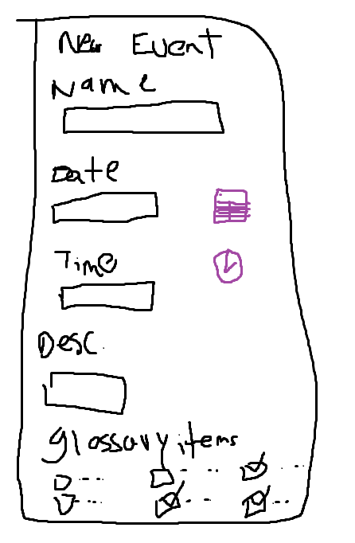

# Shape Up Pitch: Custom Event & Procedure Details Integration for Capstone Project

## Contributor

- Ranbir Brar (Student #: 300116072)

## Problem

- The focus of our Capstone project is an app that is designed for parents whose children are undergoing surgeries at CHEO and the Stollery Childern's Hospital. The goal of the app is to present a wide range of standard surgical procedures, however, surgeries can be unique and sometimes don't fit into predefined categories. These custom procedures often come from individual health needs, leading to tailor-made and/or combined procedures.

- As we collected feedback for our app, we noticed there was a gap in what was currently offered. Users expressed th need to add and customize their own surgical details, something our app does not currently support. This limitation hindered our goal to provide a thorough experience to our users, especially those who wanted to capture surgeries or events outside of standard definitions. So, to enhance user experience and inclusivity, we are considering introducing a feature allowing users to input personalized surgery details and events.

## Appetite

- By adding the new feature that allows users to add and customize their own surgery events, our objective is to enhance the app's practicality and user interaction. Our focus is to create a straightforward approach, especially considering those not familiar with advanced tech interfaces.
- We're looking at a 6-week develop cycle for this addition. This duration is adequate for introducing this feature efficiently into the app, ensuring its robustness and ease of use for all users.

## Solution

- To address the problem, the app will incorporate a 'Custom Event Creation Screen' where users can enter relevant details about their surgery or related events. The designed interface will be intuitive, guiding users through steps to fill in the event title, date, time, and a brief description. Users can specify the event type and further chance their entries by associating glossary terms related to the procedure. Here's our fat marker design of the intended interface:

- The event creation process is intended to be very simple. Selecting a date or time triggers a simple calendar or clock interface, ensuring users are not required to manually type these details.
- Furthermore, the multi-select glossary option is an innovative approach, providing users an informative list of medical terms they can associate with their event, ensuring they remain well-informed and confident.

## No-Gos

- During this 6-week cycle to implement this feature, the team won't embark on integrating any unrelated functionalities to make sure that resource allocation is optimal.
- Also we won't overcomplicated the process by introducing advanced features that could potentially overwhelm the user. The objective is to maintain simplicity and effectiveness.

## Rabbit Holes

- While we remain optimistic about the project's trajectory, potential challenges cannot be overlooked. Since there is a vast amount of medical terminologies and their implications, we need to make sure that the glossary remains concise yet comprehensive.
- Also, since the app supports multiple languages, ensuring accurate translations without loss of medical context might pose challenges. We will remain vigilant to ensure these aspects don't take away from our primary objective for the cycle.

## Conclusions

- The introduction of the Custom Event & Procedure Details feature is important for enhancing our app's user-centricity. We plan to improve engagement, user satisfaction, and overall app usefulness by granting users the choice to document their surgical experiences with precision.

## Key Milestones

- Weeks 1-2: Ideation, requirement collection, and design
- Weeks 3-4: Coding, incorporating feedback, and testing
- Weeks 5-6: Refining, Testing, and launch of feature
